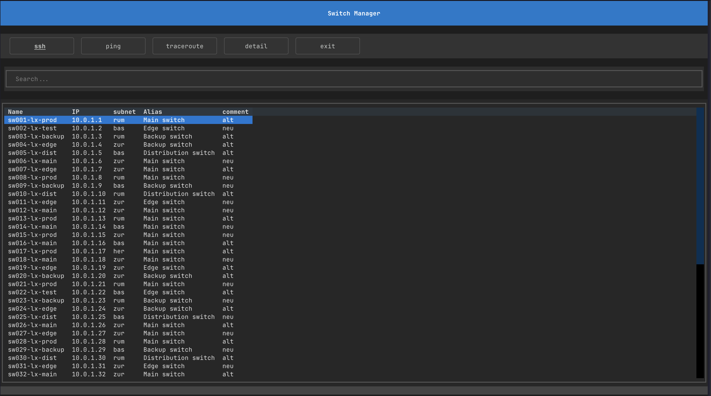

# Switch Manager

<p align="center">
    
    <br/>
    Master Your Network Magic!
</p>

## Introduction

Switch Manager is a simple tool to manage your network switches.

## Features

- Nicely show all your switches
- SSH to your switches
- Ping your switches
- Trace route to your switches

## Installation

```bash
source venv/bin/activate
pip install -r requirements.txt 
```

## Screenshots

<p align="center">
    
</p>

<p align="center">
    
</p>

