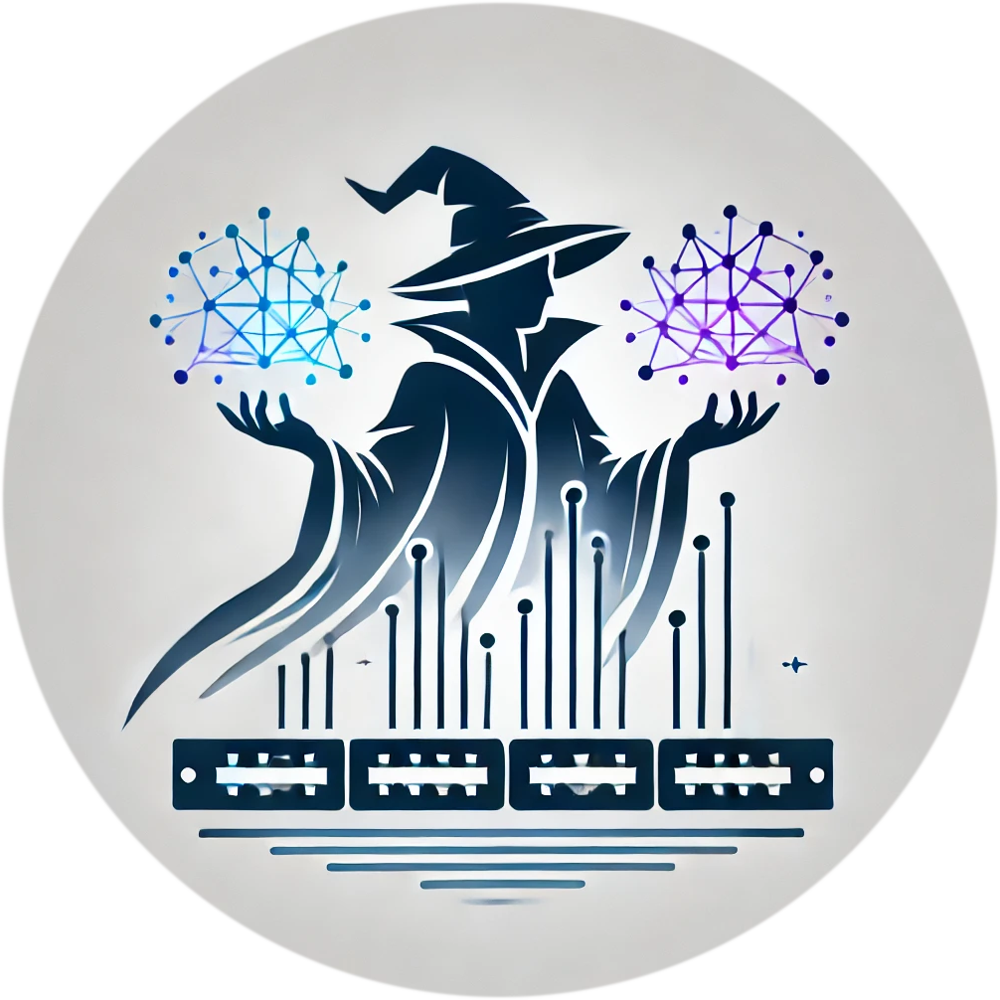
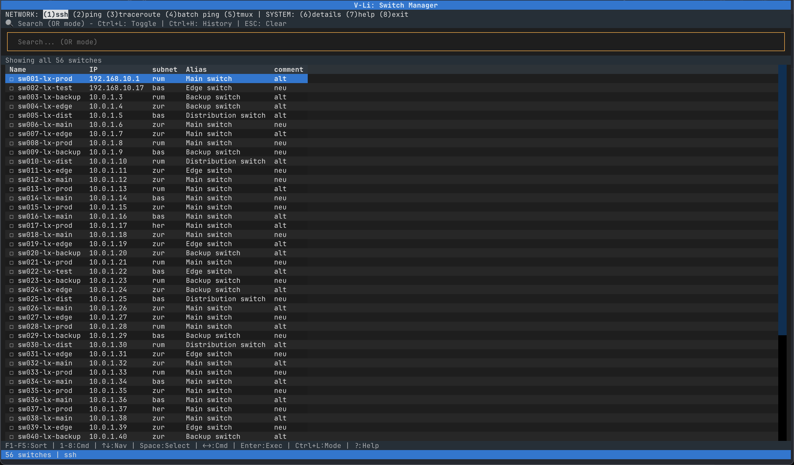
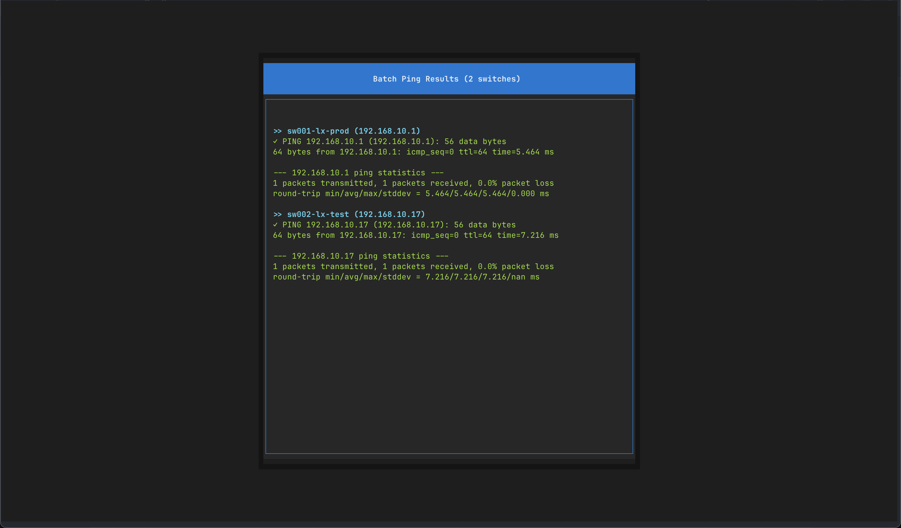

# V-Li: Switch Manager

<p align="center">
    
    <br/>
    Master Your Network Magic!
</p>

<p align="center">
    <a href="https://www.python.org/downloads/"></a>
   </a>
    <a href="https://textual.textualize.io/"></a>
    <a href="https://github.com/psf/black"></a>
    
    
</p>

## Introduction

V-Li Switch Manager is a **keyboard-first terminal user interface (TUI)** for managing network switches. Built with [Textual](https://textual.textualize.io/), it provides network administrators with fast, efficient access to common network operations - all without leaving your terminal.

**Why V-Li?** Think **"Vim for network operations"** - fast, keyboard-driven, and designed for power users who value efficiency.

### Key Benefits

- **⚡ Lightning Fast**: No GUI overhead, just pure terminal speed
- **⌨️ Keyboard-First**: Navigate and execute commands without touching your mouse
- **🔍 Smart Filtering**: Real-time search with OR/AND modes to find switches instantly
- **🔒 Secure by Design**: Input validation and safe command execution built-in
- **🚀 Batch Operations**: Execute commands on multiple switches in parallel
- **🎯 Multi-Switch Control**: TMUX integration for synchronized multi-switch sessions
- **💡 Visual Feedback**: Rich status indicators showing current state at a glance

## Features at a Glance

### 🌐 Network Operations
- **SSH Connections**: Open terminal sessions to individual switches (Command 1)
- **Live Ping**: Real-time streaming ping output with 4 ICMP packets (Command 2)
- **Traceroute**: Live route tracing diagnostics (Command 3)
- **Batch Ping**: Ping multiple switches in parallel with color-coded results (Command 4)
- **TMUX Sync**: Control multiple switches simultaneously with synchronized panes (Command 5)

### 📊 Data Management
- **CSV Import**: Load switch inventory from semicolon-delimited CSV files
- **Real-Time Search**: Type to search instantly across all switch fields
- **OR/AND Modes**: Toggle search logic (match ANY term vs match ALL terms)
- **Multi-Column Sort**: Sort by Name, IP, subnet, aliases, or comments (F1-F5)
- **Multi-Selection**: Select multiple switches for batch operations (Space bar)

### 🛠️ Advanced Features
- **Search History**: Track and recall previous searches (Ctrl+H - planned)
- **Switch Details**: View comprehensive switch information (Command 6)
- **Interactive Help**: Built-in keyboard shortcuts guide (Command 7 or `?`)
- **Safety Confirmations**: Prompts before destructive or batch operations
- **Streaming Output**: Real-time command output without buffering delays

## Quick Start

### 🎬 Super Easy Way (Recommended)

```bash
# 1. Clone the repository
git clone <repository-url>
cd switch-manager

# 2. Run the launcher script - it does everything automatically!
./run.sh

# That's it! The script will:
# ✓ Check Python version (3.11+ required)
# ✓ Create virtual environment
# ✓ Install all dependencies
# ✓ Configure environment variables
# ✓ Launch the application
```

**First time setup takes ~30 seconds. Subsequent launches are instant!**

### 📋 Manual Way (Alternative)

```bash
# 1. Clone and setup
git clone <repository-url>
cd switch-manager
python3 -m venv venv
source venv/bin/activate

# 2. Install dependencies
pip install -r requirements.txt

# 3. Configure your SSH username
export SM_USER="your_username"

# 4. Run the application
python -m switch_manager
```

### 🎯 Start Using

Once launched:
- **Type** to search switches
- Press **1-8** to select commands
- Press **Enter** to execute
- Press **?** for help

---

## Installation

### Prerequisites
- **Python 3.11+** (check with `python3 --version`)
- **Terminal with true color support** (most modern terminals)
- **TMUX** (optional, only for Command 5 - synchronized multi-switch sessions)
  - Install on macOS: `brew install tmux`
  - Install on Ubuntu/Debian: `sudo apt install tmux`
  - Install on Fedora/RHEL: `sudo dnf install tmux`

### Detailed Setup

```bash
# Clone the repository
git clone <repository-url>
cd switch-manager

# Create and activate virtual environment
python3 -m venv venv
source venv/bin/activate  # On Windows: venv\Scripts\activate

# Install dependencies
pip install -r requirements.txt

# Or install in development mode (for contributors)
pip install -e ".[dev]"
```

## Configuration

### Environment Variables

Set these environment variables before running the application:

```bash
# REQUIRED: SSH username for connections
export SM_USER="your_username"

# OPTIONAL: Path to CSV data file (default: data.csv in current directory)
export SM_CSV_DATA="data.csv"
# Examples:
#   export SM_CSV_DATA="/path/to/switches.csv"
#   export SM_CSV_DATA="~/network/production-switches.csv"

# OPTIONAL: CSV delimiter character (default: semicolon ;)
export SM_DELIMITER=";"
# Examples:
#   export SM_DELIMITER=","  # For comma-separated files
#   export SM_DELIMITER="\t" # For tab-separated files

# OPTIONAL: TMUX behavior mode (default: attach)
export SM_TMUX_MODE="attach"
# Options:
#   "attach"   - Create TMUX session and attach immediately (V-Li exits)
#   "detached" - Create TMUX session in background (V-Li keeps running)

# OPTIONAL: Enable debug logging (default: false)
export SM_DEBUG="false"
```

**💡 Tip:** Add these to your shell profile (`~/.bashrc`, `~/.zshrc`) to persist them:
```bash
echo 'export SM_USER="your_username"' >> ~/.bashrc
source ~/.bashrc
```

### CSV Data Format

The application expects a semicolon-delimited CSV file with these columns:

| Column | Required | Description | Example |
|--------|----------|-------------|---------|
| **Name** | Yes | Switch hostname or identifier | `sw001-lx-prod` |
| **IP** | Yes | IPv4 address | `192.168.1.1` |
| **subnet** | Yes | Subnet or location code | `rum`, `bas`, `10.0.0.0/24` |
| **aliases** | No | Alternative names (comma-separated) | `Main switch,Core` |
| **comment** | No | Description or notes | `Production core switch` |

**Example CSV file:**

```csv
Name;IP;subnet;aliases;comment
sw001-lx-prod;192.168.1.1;rum;Main switch,Core;Production core switch
sw002-lx-test;192.168.1.7;bas;Edge switch;Test environment
sw003-lx-backup;10.0.1.3;rum;Backup switch;Backup core switch
sw004-lx-dev;172.16.0.5;dev;Dev switch,Lab;Development lab
```

**📝 Notes:**
- Only the first 5 columns are used by the application
- Additional columns are ignored but preserved in the data file
- Column order must match exactly as shown above
- First row is treated as header and skipped during import

## Usage Guide

### Running the Application

```bash
# Activate virtual environment (if not already active)
source venv/bin/activate

# Run the application
python -m switch_manager

# Or if installed as package
switch-manager

# Or use the convenience script (sets SM_USER automatically)
./run.sh
```

---

## Complete Keyboard Reference

### 🔍 Search & Filter
| Key | Action | Details |
|-----|--------|---------|
| **Type any text** | Start search | Auto-focuses search box, searches all fields |
| **Ctrl+L** | Toggle OR/AND mode | OR: match ANY term, AND: match ALL terms |
| **ESC** | Clear search | Returns focus to table, shows all switches |
| **Enter** | Return to table | Keeps current filter, returns focus to table |

### 🧭 Navigation
| Key | Action | Details |
|-----|--------|---------|
| **↑ / ↓** | Move selection | Navigate through switch table (wraps around) |
| **← / →** | Switch commands | Cycle through commands 1-8 in command bar |
| **Space** | Toggle selection | Select/deselect switch for batch operations |
| **F1** | Sort by Name | Toggle ascending/descending |
| **F2** | Sort by IP | IPv4 address sorting |
| **F3** | Sort by subnet | Alphabetical subnet sorting |
| **F4** | Sort by Alias | Alphabetical alias sorting |
| **F5** | Sort by comment | Alphabetical comment sorting |

### ⚡ Commands
| Key | Command | Description |
|-----|---------|-------------|
| **1** | SSH | Open new terminal window with SSH connection to selected switch |
| **2** | Ping | Stream live ping output (4 packets) to selected switch |
| **3** | Traceroute | Stream live traceroute output to selected switch |
| **4** | Batch Ping | Ping all selected switches (or all filtered) in parallel |
| **5** | TMUX | Open synchronized TMUX session for multi-switch control |
| **6** | Details | Show all fields for selected switch |
| **7** | Help | Display comprehensive help modal |
| **8** | Exit | Quit application (with confirmation) |
| **Enter** | Execute | Run the currently selected command |
| **q** | Quick exit | Same as Command 8 (Exit with confirmation) |
| **?** | Quick help | Same as Command 7 (Help modal) |

### 📋 Modals
| Key | Action | Context |
|-----|--------|---------|
| **ESC** | Close modal | Works in all modals (ping, traceroute, help, details) |
| **y** | Confirm | In confirmation dialogs (batch ping, TMUX, exit) |
| **n** | Cancel | In confirmation dialogs |

---

## Common Workflows

### Workflow 1: Quick SSH to a Switch
```
1. Type switch name or IP       → "sw001" or "192.168"
2. Press 1 (or → then Enter)    → Command 1: SSH
3. New terminal opens           → SSH session starts
```

### Workflow 2: Check Connectivity of Production Switches
```
1. Type "prod"                  → Filters to production switches
2. Press Space on each switch   → Select multiple switches
3. Press 4 (Batch Ping)         → Command 4: Batch Ping
4. Press y to confirm           → Parallel ping execution
5. View color-coded results     → Green = reachable, Red = unreachable
```

### Workflow 3: Synchronized Configuration Change
```
1. Type "core"                  → Filter to core switches
2. Press Space to select all    → Multi-select target switches
3. Press 5 (TMUX)               → Command 5: TMUX Sync
4. Press y to confirm           → Creates TMUX session
5. Type commands once           → Executes on all switches simultaneously
6. Ctrl+B, then D               → Detach from TMUX (session keeps running)
7. Relaunch app                 → Continue using V-Li
```

### Workflow 4: Find and Investigate Problem Switch
```
1. Press F2                     → Sort by IP address
2. Type "10.0"                  → Filter to specific subnet
3. Press ↓ to select switch     → Navigate to target
4. Press 2 (Ping)               → Check connectivity
5. ESC to close                 → Return to table
6. Press 3 (Traceroute)         → Check route if ping fails
7. Press 1 (SSH)                → Connect to investigate
```

### Workflow 5: Search with AND Mode
```
1. Type "prod rum"              → Searches for switches with EITHER term (OR mode)
2. Press Ctrl+L                 → Toggle to AND mode
3. Now shows only switches      → Switches matching BOTH "prod" AND "rum"
4. Press Ctrl+L again           → Toggle back to OR mode
```

---

## Command Details

### Command 1: SSH
Opens a **new terminal window** with an SSH connection to the selected switch.

- **Requirements**: `SM_USER` environment variable must be set
- **Platform support**: macOS (Terminal.app), Linux (gnome-terminal, konsole, xterm), Windows (Windows Terminal, cmd)
- **Security**: IP address and username validated before execution
- **Note**: V-Li app **continues running** in the original terminal

**Example terminal command executed:**
```bash
ssh your_username@192.168.10.1
```

### Command 2: Ping
Streams **live ping output** to the selected switch (4 ICMP packets).

- **Output**: Real-time streaming in modal window
- **Security**: IP address validated before execution
- **Exit**: Press `ESC` to close modal and terminate ping process

**Example command executed:**
```bash
ping -c 4 192.168.10.1
```

### Command 3: Traceroute
Streams **live traceroute output** to the selected switch.

- **Output**: Real-time hop-by-hop route display
- **Security**: IP address validated before execution
- **Exit**: Press `ESC` to close modal and terminate traceroute process

**Example command executed:**
```bash
traceroute 192.168.10.1
```

### Command 4: Batch Ping
Pings **multiple switches in parallel** with aggregated results.

- **Target**: Works on selected switches (Space to select), or all filtered switches if none selected
- **Confirmation**: Shows count and asks for confirmation
- **Execution**: Parallel execution using asyncio for speed
- **Results**: Color-coded display (green = reachable, red = unreachable)
- **Security**: All IP addresses validated before execution

**Example workflow:**
1. Filter switches: `"prod"` → Shows 10 production switches
2. Press `4` → "Batch ping 10 switches?"
3. Press `y` → Pings all 10 in parallel
4. View results → `sw001: ✓ Reachable (12.3ms avg)`

### Command 5: TMUX Synchronized Session
Creates a **TMUX session with synchronized panes** for controlling multiple switches at once.

- **Target**: Works on selected switches, or all filtered switches if none selected
- **Requirements**: TMUX must be installed (`tmux --version`)
- **Layout**: Tiled layout with one pane per switch
- **Synchronization**: All panes synchronized (type once, executes on all)
- **Session name**: `switch-manager`
- **Security**: Strong warning shown, requires explicit confirmation

**🎛️ Two Modes (Controlled by `SM_TMUX_MODE`):**

#### Mode 1: Attach (Default)
```bash
export SM_TMUX_MODE="attach"
```
- V-Li **exits** and **attaches to TMUX session immediately**
- TMUX takes over your terminal completely
- Use this when you want to work in TMUX right away
- To return to V-Li: Detach (`Ctrl+B`, then `D`), then relaunch V-Li

**Workflow:**
1. Filter: `"core"` → 4 core switches
2. Press `5` → Confirmation dialog
3. Press `y` → V-Li exits, TMUX session opens
4. Type commands → Executes on all 4 switches simultaneously
5. Press `Ctrl+B`, then `D` → Detach from TMUX
6. Run: `python -m switch_manager` → Restart V-Li

#### Mode 2: Detached
```bash
export SM_TMUX_MODE="detached"
```
- TMUX session created **in background**
- V-Li **keeps running** - you can continue using it
- Use this when you want to prep the session and attach later
- Attach manually when ready: `tmux attach -t switch-manager`

**Workflow:**
1. Filter: `"core"` → 4 core switches
2. Press `5` → Confirmation dialog
3. Press `y` → Session created in background
4. Continue using V-Li (search, view details, etc.)
5. When ready, open new terminal: `tmux attach -t switch-manager`
6. Work in TMUX, V-Li still running in original terminal

**⚠️ Important for Both Modes:**
- Commands typed execute on **ALL switches** simultaneously
- TMUX session continues running after detaching
- You can re-attach anytime from any terminal

**Common TMUX Commands:**
```bash
# Attach to existing session
tmux attach -t switch-manager

# Detach from session (keeps running)
Ctrl+B, then D

# Kill session completely
tmux kill-session -t switch-manager

# List all sessions
tmux list-sessions
```

### Command 6: Details
Shows **comprehensive information** about the selected switch in a modal.

- **Fields**: Name, IP, subnet, aliases, comment, and any additional CSV columns
- **Format**: Labeled fields for easy reading
- **Exit**: Press `ESC` to close

### Command 7: Help
Displays **interactive help modal** with all keyboard shortcuts and commands.

- **Shortcut**: Press `?` for instant help
- **Content**: Complete keyboard reference, commands, and tips
- **Exit**: Press `ESC` to close

### Command 8: Exit
Exits the application with **confirmation dialog**.

- **Shortcut**: Press `q` for quick exit
- **Confirmation**: "Are you sure?" dialog (prevents accidental exits)
- **Cancel**: Press `n` or `ESC` to cancel, `y` to confirm

---

## Troubleshooting

### Common Issues

#### "SM_USER environment variable not set"
**Problem**: SSH or TMUX commands fail because SSH username is not configured.

**Solution:**
```bash
export SM_USER="your_username"
# Or add to your shell profile for persistence:
echo 'export SM_USER="your_username"' >> ~/.bashrc
source ~/.bashrc
```

#### "CSV file not found: data.csv"
**Problem**: Application can't find the CSV file.

**Solution:**
```bash
# Option 1: Create data.csv in the current directory
# Option 2: Specify a different path
export SM_CSV_DATA="/path/to/your/switches.csv"
python -m switch_manager
```

#### "TMUX not found"
**Problem**: Command 5 (TMUX) fails because TMUX is not installed.

**Solution:**
```bash
# macOS
brew install tmux

# Ubuntu/Debian
sudo apt install tmux

# Fedora/RHEL
sudo dnf install tmux

# Verify installation
tmux --version
```

#### Search not working / No results found
**Problem**: Search returns no results even though switches exist.

**Solution:**
- Check your search mode (OR vs AND) - press `Ctrl+L` to toggle
- Verify spelling - search is case-insensitive but must match text
- Clear search with `ESC` and try again
- Remember: AND mode requires ALL terms to match (more restrictive)

#### Terminal window doesn't open for SSH
**Problem**: Command 1 (SSH) doesn't open a new terminal window.

**Solution:**
- **macOS**: Verify Terminal.app is installed (default on macOS)
- **Linux**: Install a terminal emulator: `sudo apt install gnome-terminal`
- **Check permissions**: Ensure the app has permission to spawn new processes
- **View error**: Check status bar for error messages

#### Can't exit TMUX session
**Problem**: Stuck in TMUX, can't return to V-Li.

**Solution:**
```bash
# Detach from TMUX (keeps session running)
Ctrl+B, then D

# Kill the TMUX session entirely
Ctrl+B, then type: :kill-session

# Or from outside TMUX
tmux kill-session -t switch-manager
```

#### App crashes on startup
**Problem**: Application fails to start.

**Solution:**
```bash
# Enable debug mode to see detailed errors
export SM_DEBUG="true"
python -m switch_manager

# Check Python version (requires 3.11+)
python3 --version

# Reinstall dependencies
pip install -r requirements.txt --force-reinstall

# Try running in the virtual environment
source venv/bin/activate
python -m switch_manager
```

#### Invalid IP address error
**Problem**: Commands fail with "Invalid IP address" error.

**Solution:**
- Verify the IP address in your CSV file is valid (e.g., `192.168.1.1`)
- Check for extra spaces or special characters
- IPv6 is not currently supported (IPv4 only)

---

## Frequently Asked Questions (FAQ)

### General

**Q: Can I use this with routers, firewalls, or other network devices?**
A: Yes! V-Li works with any network device accessible via SSH. Just add the device to your CSV file with its IP address.

**Q: Does V-Li support IPv6?**
A: Not currently. IPv6 support is planned for a future release. Only IPv4 addresses are supported in the MVP.

**Q: Can I use comma-separated CSV files instead of semicolons?**
A: Yes! Set the `SM_DELIMITER` environment variable:
```bash
export SM_DELIMITER=","
```

**Q: How many switches can V-Li handle?**
A: V-Li has been designed to handle thousands of switches efficiently. Search filtering uses debouncing and the table uses virtual scrolling for performance.

**Q: Can I customize the keyboard shortcuts?**
A: Not in the MVP. Keyboard shortcut customization is planned for a future release.

### Features

**Q: How do I return to V-Li after opening a TMUX session?**
A: It depends on your `SM_TMUX_MODE` setting:

- **Attach mode (default)**: V-Li exits when TMUX opens. To return: Press `Ctrl+B`, then `D` to detach from TMUX, then relaunch V-Li with `python -m switch_manager`.

- **Detached mode**: V-Li never exits! The TMUX session is created in the background. V-Li keeps running in your original terminal. You can attach to TMUX from a different terminal window.

**Q: Can I re-attach to a TMUX session after detaching?**
A: Yes! Use: `tmux attach -t switch-manager`

**Q: Which TMUX mode should I use?**
A:
- **Use "attach" mode** if you want to work in TMUX immediately and don't need V-Li open
- **Use "detached" mode** if you want to keep V-Li open for reference (IP addresses, switch names) while working in TMUX in another terminal

Set your preference: `export SM_TMUX_MODE="detached"` (add to `~/.bashrc` to persist)

**Q: What's the difference between OR and AND search modes?**
A:
- **OR mode**: Matches switches containing ANY of your search terms (broader)
- **AND mode**: Matches switches containing ALL of your search terms (narrower)

Example: Searching for "prod core"
- **OR mode**: Shows switches with "prod" OR "core" (more results)
- **AND mode**: Shows switches with BOTH "prod" AND "core" (fewer results)

**Q: Can I select multiple switches for batch operations?**
A: Yes! Press `Space` to toggle selection on individual switches. Then use Command 4 (Batch Ping) or Command 5 (TMUX) to operate on all selected switches.

**Q: What happens if I don't select any switches for batch operations?**
A: The operation will apply to **all currently filtered switches**. For example, if you search for "prod" and press `4` (Batch Ping) without selecting any, it will ping all production switches.

**Q: How do I stop a ping or traceroute in progress?**
A: Press `ESC` to close the modal and terminate the process immediately.

**Q: Can I SSH to multiple switches without TMUX?**
A: Yes! Use Command 1 (SSH) repeatedly. Each opens in a new terminal window, and V-Li keeps running so you can open as many as needed.

### Security

**Q: Is it safe to use V-Li in production?**
A: Yes! V-Li implements strict security measures:
- All IP addresses are validated
- Usernames are validated (alphanumeric only)
- No shell interpolation (prevents command injection)
- All subprocess calls use safe argument lists

**Q: Does V-Li store my SSH passwords?**
A: No. V-Li doesn't handle authentication at all. It simply spawns SSH connections using your system's SSH client. Use SSH keys or your system's credential manager for authentication.

**Q: Can V-Li execute arbitrary commands on switches?**
A: In the MVP, V-Li only executes predefined commands (SSH, ping, traceroute). Custom command execution is planned for future releases with appropriate safety measures.

### Workflow

**Q: Can I save filtered switch groups?**
A: Not in the MVP. Saved filter presets (switch groups) are planned for a future release.

**Q: Can I export search results to a new CSV file?**
A: Not in the MVP. CSV export is planned for a future release.

**Q: Does V-Li track command history or logs?**
A: Search history is tracked (planned: Ctrl+H to view). Command execution logging is planned for a future release.

**Q: Can I customize the CSV columns or add custom fields?**
A: The first 5 columns (Name, IP, subnet, aliases, comment) are used by V-Li. Additional columns in your CSV are preserved but not displayed. Custom field configuration is planned for future releases.

---

## Tips & Tricks

### 🎯 Power User Tips

1. **Quick Filter + SSH**: Type a few letters to filter, then press `1` and `Enter` - you're SSHed in 3 keystrokes!

2. **Batch Connectivity Check**: Search for a subnet (e.g., "10.0"), press Space multiple times to select switches, then `4` for parallel ping.

3. **Sort for Subnet Organization**: Press `F3` to sort by subnet, making it easy to spot all switches in a specific location.

4. **AND Mode for Precision**: Need switches that are both "prod" AND in "rum" subnet? Type "prod rum" and press `Ctrl+L` to toggle AND mode.

5. **TMUX for Emergency Updates**: Filter to affected switches, use Command 5 to open synchronized TMUX, execute fix commands once - applied to all simultaneously. Tip: Use detached mode (`SM_TMUX_MODE="detached"`) to keep V-Li open for reference!

6. **Persistent Environment Variables**: Add to `~/.bashrc` or `~/.zshrc`:
   ```bash
   export SM_USER="your_username"
   export SM_CSV_DATA="/path/to/your/switches.csv"
   export SM_TMUX_MODE="detached"  # Keep V-Li running when using TMUX
   ```

7. **Multiple SSH Sessions**: Command 1 keeps the app running - open SSH to multiple switches and keep V-Li available for reference.

8. **Quick Help Reference**: Forgot a shortcut? Just press `?` for instant help.

9. **Safe Exploration**: ESC is your friend - it cancels searches, closes modals, and returns to safety. Never be afraid to explore!

10. **Traceroute for Diagnostics**: Ping fails? Press `3` to see exactly where the route breaks.

### 🔧 Workflow Optimization

**Daily Network Admin Routine:**
```
Morning Check:
1. Run V-Li
2. Press F1 to sort by name
3. Scan for anomalies
4. Press 4 for batch ping on suspicious switches
5. Investigate failures with traceroute (Command 3)
6. SSH to problem switches (Command 1)

Emergency Response:
1. Filter affected switches (type location code)
2. Press Space to select all
3. Press 5 for TMUX synchronized session
4. Execute fix commands once on all switches
5. Verify with batch ping

Documentation:
1. Filter by subnet (type subnet code)
2. Press 6 to view details of each switch
3. Take notes for documentation
```

**Custom Launcher Script:**
Create a `vli` alias in your shell profile:
```bash
# Add to ~/.bashrc or ~/.zshrc
alias vli='cd ~/switch-manager && source venv/bin/activate && export SM_USER=$(whoami) && python -m switch_manager'

# Now just type: vli
```

### 📊 CSV Management Tips

**Organize Your CSV:**
- Use consistent naming: `<name>-<location>-<env>` (e.g., `sw001-lx-prod`)
- Add location codes to subnet field for easy filtering
- Use aliases for alternate names or acronyms
- Put important notes in comment field (use cases, known issues)

**Example well-organized CSV:**
```csv
Name;IP;subnet;aliases;comment
sw001-ny-prod;192.168.1.1;datacenter-a;NYC-Core,Main;Primary core switch - DO NOT REBOOT
sw002-ny-prod;192.168.1.2;datacenter-a;NYC-Edge;Edge switch for floor 3
sw003-la-test;10.0.1.1;datacenter-b;LA-Test,Lab;Test environment - safe to reboot
```

Benefits:
- Search "prod" finds all production switches
- Search "ny" finds all New York switches
- Search "datacenter-a" finds all switches in datacenter A
- AND mode lets you combine: "prod ny" = production switches in NYC

---

## Project Structure

```
switch-manager/
├── switch_manager/         # Main application package
│   ├── __init__.py
│   ├── __main__.py        # Entry point
│   ├── app.py             # Main app class
│   ├── config.py          # Configuration management
│   ├── models.py          # Data models
│   ├── manager.py         # Business logic
│   ├── screens/           # Screen components
│   ├── widgets/           # Custom widgets
│   ├── commands/          # Command execution
│   └── utils/             # Utility functions
├── tests/                 # Test suite
├── docs/                  # Documentation
│   ├── PLAN.md           # Functional specification
│   └── ARCHITECTURE.md   # Technical architecture
├── data.csv              # Sample switch data
├── requirements.txt      # Python dependencies
└── pyproject.toml        # Package configuration
```

## Documentation

- **[PLAN.md](docs/PLAN.md)** - Complete functional specification
- **[ARCHITECTURE.md](docs/ARCHITECTURE.md)** - Technical architecture and design patterns
- **[CLAUDE.md](CLAUDE.md)** - AI collaboration guide

## Development

### Running Tests

```bash
# Install development dependencies
pip install -e ".[dev]"

# Run tests
pytest

# Run with coverage
pytest --cov=switch_manager
```

### Code Quality

```bash
# Format code
black switch_manager tests

# Lint code
ruff check switch_manager tests

# Type checking
mypy switch_manager
```

## Security

The application implements strict security measures:
- **IP Validation**: All IP addresses validated using `ipaddress` module
- **Username Validation**: Only alphanumeric, dots, dashes, underscores allowed
- **Safe Command Execution**: No shell interpolation, argument lists only
- **Input Sanitization**: All user input validated before execution

## Screenshots

<p align="center">
    
</p>

<p align="center">
    
</p>

## Contributing

Contributions are welcome! Please read the documentation in `docs/` before contributing.

## License

MIT License - See LICENSE file for details

## Roadmap

See [ARCHITECTURE.md](docs/ARCHITECTURE.md) for planned features and enhancements.

