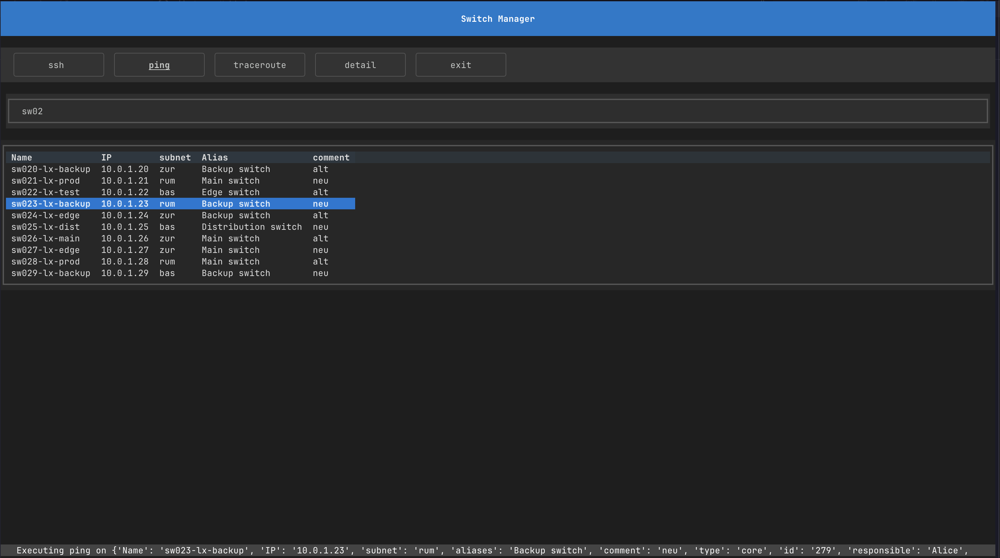

# V-Li: Switch Manager

<p align="center">
    
    <br/>
    Master Your Network Magic!
</p>

## Introduction

The V-Li: Switch Manager is a simple tool to manage your network switches. It provides a simple Text based UI to check on your switches and connect to them.

## Features

- Nicely show all your switches
- SSH to your switches
- Ping your switches
- Trace route to your switches

## Installation

```bash
source venv/bin/activate
pip install -r requirements.txt 
```

## Usage
```bash
export SM_USER=$(whoami)            # Used for outgoing SSH connections
export SM_CSV_DATA=$(pwd)/data.csv  # Optionally set a different location for the CSV file

python3 main.py
```

## Datasource File

The source file that is being parsed is currently expecting the following format.

The manager looks for the file with the name data.csv in the same directly as the application. This can be overwritteb by setting the SM_CSV_DATA environment variable.

A sample file has been provided.

```csv
Name;IP;subnet;aliases;comment;type;id;responsible;aix_server
sw001-lx-prod;192.168.10.1;rum;Main switch;alt;core;455;Alice;server5
sw002-lx-test;192.168.10.17;bas;Edge switch;neu;distribution;429;Alice;server3
sw003-lx-backup;10.0.1.3;rum;Backup switch;alt;core;279;Alice;server5
sw004-lx-edge;10.0.1.4;zur;Backup switch;alt;edge;745;Charlie;server2
sw005-lx-dist;10.0.1.5;bas;Distribution switch;alt;edge;605;David;server9
```


## Screenshots

<p align="center">
    
</p>

<p align="center">
    
</p>

